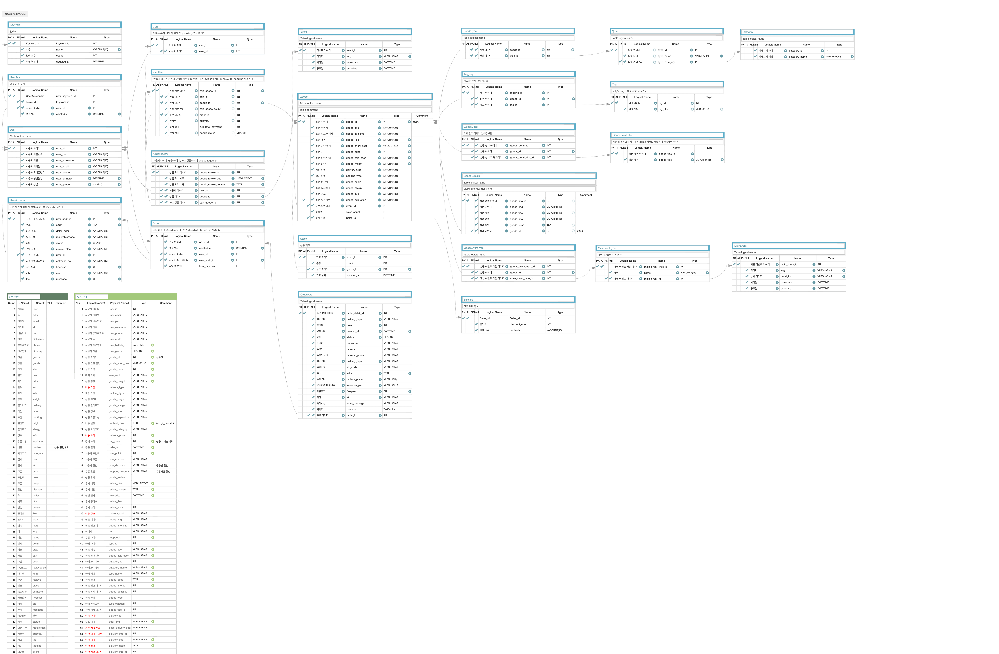
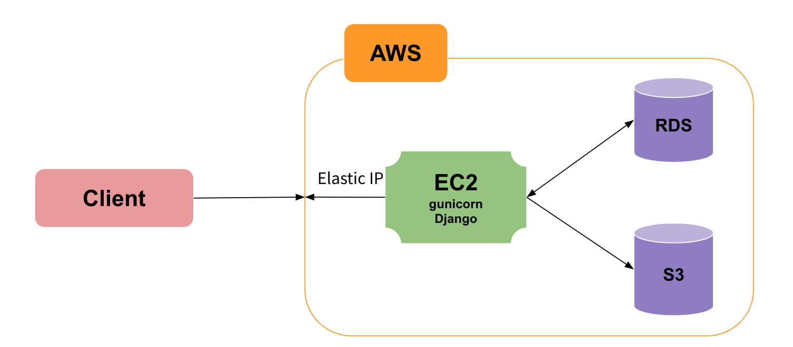

#### fastcampus python school & ios school collaborate


# [market kulry](https://www.kurly.com/shop/main/index.php) clone project - backend repo

여러가지 신선재료 샛별배송 서비스를 제공하는 Market Kurly 의 web server 를 Clone 하는 프로젝트 입니다.


프로젝트 기간: 2020.08.20 - 2020.10.08

```
현재 대한민국 신선재료배송 서비스 시장을 선도하고 있는 Market Kurly 앱을 모방하여 개발함으로서,
실제로 상용화되어 있는 앱을 개발할 수 있는 역량을 키우고 증명하는 것을 목표로 개발을 기획하였습니다.
```

## Team Members
- 김상희
- 강미나
- 전영훈


## Requirements
- language
	- Python 3.8.2
- framework
	- Django 3.1

## Dependencies
- selenium - **crawling**
- baker - **testcode**
- rest_framework - **api**
- rest_framework.authtoken - **token**
- drf-nested-routers - **url form**
- django_extensions - **shell**
- django_filters - **filter**
- drf_yasg - **api docs**
- debug_toolbar - **optimizing**
- django_crontab - **scheduler**
- django redis - **cache**


## Development Tools
- Adobe XD : 체계적으로 뷰를 관리하고 코드를 재사용하기 위하여 Adobe XD 를 사용해 프로젝트 초반에 모든 뷰 구성을 확인했습니다.
- Discord : 커뮤니케이션 및 코드리뷰를 위한 화면 공유용도로 사용하였습니다.
- Github Projects : Github Issue 와 연동하여 프로젝트를 좀 더 수월하게 관리할 목적으로 사용했습니다.
- Google Meet : 트러블슈팅 회의에 사용했습니다.
- Trello : BackEnd 팀과 프로젝트 진행상황 공유 목적으로 사용되었습니다.

최대한 여러가지 툴을 사용하고 경험해봄으로서, 이후 프로젝트에서는 더 적합한 툴을 시행착오 없이 선택할 수 있는 경험을 쌓는 것을 목표로 하였습니다.


## Setup

```https://github.com/TEAM3x3/backend``` Fork

```shell
# git clone git@github.com:<user id>/backend.git
# cd <폴더 이름>
pyenv virtualenv 3.8.2 <가상환경 이름>
pyenv local <가상환경 이름>

pip install -r requiremens.text
cd app
./manage.py makemigrations
./manage.py migrate
```

```python
# root/.env
DB_HOST=localhost
DB_NAME=fc-13final
DB_USER=postgres
DB_PASSWORD=
DB_PORT=5432
DB_DEPLOY_HOST=<RDS EndPoint>
DB_DEPLOY_NAME=postgres
DB_DEPLOY_USER=postgres
DB_DEPLOY_PASSWORD=postgres
DB_DEPLOY_PORT=5432
S3_ACCESS_KEY_ID=<s3 key>
S3_SECRET_ACCESS_KEY=<s3 secret key>
```

## ERD



## architecture



### [link / pass: 6742f4](https://aquerytool.com:443/aquerymain/index/?rurl=eb280b61-5dcf-4b12-ae16-6595341b85ca)

## MVP

- 회원가입, 로그인
- 메인페이지, 카테고리
- 상품 상세정보, 배송안내
- 상품 후기
- 마이페이지, 장바구니

## API docs
[link](https://cloudy-comet-1571.postman.co/collections/5847490-3c3e8773-4e53-4ae8-a7f7-8ef4573e218d?version=latest&workspace=3b9e6b96-acb3-4058-a8b6-4d974402650f#introduction)


##### 아쉬운 점
- mptt를 사용하지 못한 점 ( 어떤 엔티티를 구현할 때 하는게 올바른지에 대한 개념 부족)
- 크롤링에 대해서 고민을 하지 않은 점 ( 상품 디테일 페이지에서 많은 데이터를 전부 드리지 못한 것)
- api와 testcode의 싱크를 맞추지 못한 점.

##### 좋았던 점
- 여러 협업 툴을 사용한 점 ( 팀 적 소통을 위한 트렐로)
- 팀 케미가 좋았던 것 